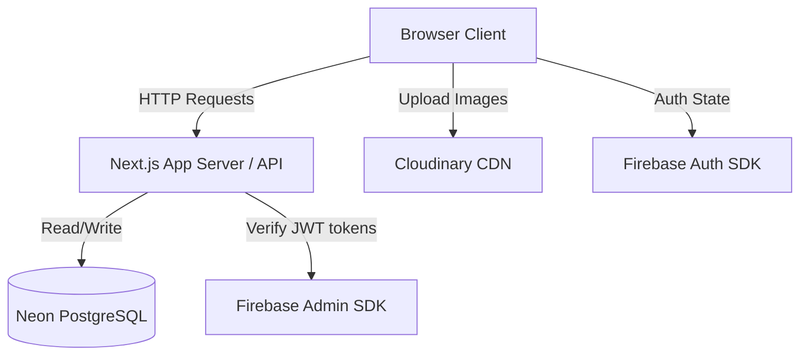

# 🏗 Architecture & Technical Documentation

This document provides a deeper dive into the technical architecture, design decisions, and data flow of the **CommuNet Platform**.

## System Overview

The application follows a modern Serverless architecture utilizing Next.js as a full-stack framework. The frontend and backend API live in the same repository, simplifying deployment and type safety.

## Core Technologies

1.  **Next.js App Router**: Utilizes React Server Components (RSC) where possible to reduce client JavaScript bundle size, falling back to Client Components (`"use client"`) for interactivity (forms, state, hooks).
2.  **Prisma ORM**: Acts as the type-safe interface to the PostgreSQL database. Schema migrations are handled via `prisma db push` and `prisma migrate`.
3.  **Firebase Authentication**: Complete replacement of the legacy custom JWT system. Handles secure user signup, login, password resets, and Google OAuth. The frontend receives an ID Token, which is passed in the `Authorization: Bearer <token>` header to protected Next.js API routes.
4.  **Tailwind CSS**: Utility-first CSS framework ensuring a highly responsive, custom-branded UI (maroon, gold, cream color palette) without the need for large CSS stylesheets.

## Authentication Flow

To secure API endpoints, the platform implements the following flow:
1.  User authenticates via Firebase Auth on the client side.
2.  `AuthContext` (`src/lib/auth-context.tsx`) tracks the user session and stores the Firebase ID token.
3.  When a user requests private data or makes a mutation (POST, PUT, DELETE), the frontend attaches the token implicitly via `getToken()` in the request header.
4.  The Next.js API route (`/api/...`) intercepts the request, uses the `firebase-admin` SDK (`src/lib/firebase-admin.ts`) to verify the token signature.
5.  If valid, the API extracts the `uid` or `email`, maps it to the Prisma database `User` record, and authorizes the action.

## Database Schema Highlights

The database is highly relational. A `User` record acts as the central node.
-   **User**: `id`, `email`, `role` (user/admin), `firebaseUid`.
-   **Posts/Content**: All content (Events, Businesses, Jobs, Achievements) contains a relational tie to the `User` who posted it (e.g., `ownerId` or `posterId`).
-   **Interactions**: `PostInteraction` table manages Likes, Comments, and Shares generically across different entity types using an `entityType` enum (event, business, achievement) to avoid table bloat.
-   **Soft Deletes**: Deleting a post often changes its `status` from `active` or `pending` to `deleted_by_admin` rather than hard-dropping the row, ensuring records are preserved for auditing.

## Deployment Pipeline

The project is structured to deploy smoothly to **Render** or **Vercel**. 
For Render, a `render.yaml` blueprint is defined in the root folder, abstracting the build command (`npm run build`) and start command (`npm start`). Crucial environment variables must be securely injected into the Render dashboard.

## File Upload Strategy

1.  **Profile Images**: Routed directly through `src/app/api/profile/upload/route.ts` using the Cloudinary Node SDK. Cloudinary allows for automatic face-cropping, compression, and fast CDN delivery critical for small avatars.
2.  **General Attachments**: Used Firebase Cloud Storage internally mapped via edge SDK routines.

## Development Workflows

-   **Seeding Data**: `npm run prisma db seed` cleans the base tables and creates dozens of mock profiles, events, and jobs to simulate a live environment for visual QA.
-   **Adding New API Routes**: To create a protected route, developers use the helper logic found in existing endpoints (e.g. `import { getAuth } from "firebase-admin/auth"` and extracting `request.headers.get('Authorization')`).

---
_End of Architecture Document_
